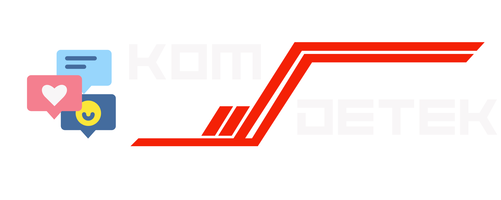
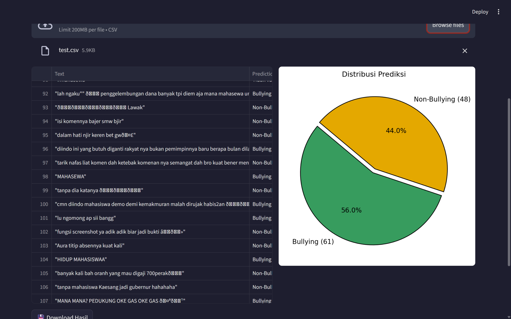
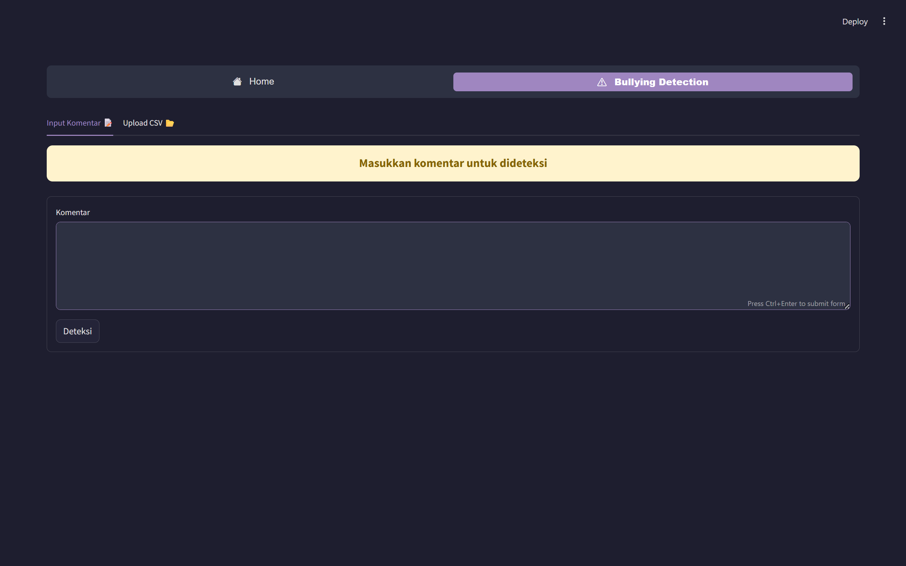

# KomDetek – Deteksi Komentar Bullying dari TikTok

**KomDetek** adalah aplikasi Streamlit yang digunakan untuk mendeteksi komentar bullying yang berasal **khusus dari platform TikTok**. Aplikasi ini memungkinkan pengguna untuk mengklasifikasi komentar secara real-time ataupun dari file CSV.



---

## 🎯 Fitur Utama

- Deteksi komentar TikTok satuan melalui input teks.
- Deteksi batch dari file CSV.
- Visualisasi hasil deteksi dalam bentuk pie chart.
- Tabel hasil klasifikasi yang interaktif.

---

## 🧰 Teknologi

- Python 3.10
- Streamlit
- Scikit-learn (SVM, Logistic Regression, Naive Bayes)
- LSTM (Keras)
- IndoNLP & Sastrawi untuk preprocessing Bahasa Indonesia

---

## 🧠 Model yang Digunakan

Semua model dilatih dari **komentar TikTok asli**, termasuk:

- `svm_model.pkl`
- `logistic_regression_model.pkl`
- `naive_bayes_model.pkl`
- `lstm_model.h5`
- `vectorizer.pkl` (TF-IDF)

---
## 📓 Link Notebook Colab

Untuk melihat proses training dan preprocessing dataset dapat dilihat pada notebook Google Colab berikut:

👉 [Klik di sini untuk membuka Notebook Colab](https://colab.research.google.com/drive/1QQB4o4Eqn4RObcmGNNvLlhokYGYVf7TS?usp=sharing)

## 🖼 Tampilan Aplikasi

### 📤 Upload Komentar TikTok via CSV



### ✍️ Deteksi Komentar Manual



---

## 📁 Struktur Folder

```bash
.
├── README.md
├── requirements.txt
├── tiktokscraped.csv
├── web.py
│
├── .streamlit/
│   └── config.toml
│
├── img/
│   ├── KomDetek.png
│   ├── Submit_Csv.png
│   └── Submit_Words.png
│
└── models/
    ├── svm_model.pkl
    ├── logistic_regression_model.pkl
    ├── naive_bayes_model.pkl
    ├── lstm_model.h5
    └── vectorizer.pkl
