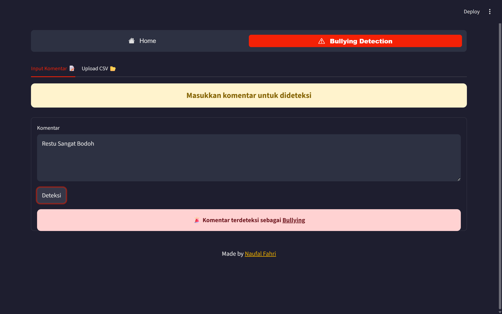

# 🛡️ KomDetek – TikTok Comment Bullying Detection

🔗 **Try it live**: [komdetek.streamlit.app](https://komdetek.streamlit.app/)

**KomDetek** is a Streamlit-based application designed to **detect bullying comments specifically from TikTok**. It allows users to classify comments in real-time or in bulk via CSV upload.


---

## 🎯 Key Features

* Detect individual TikTok comments through text input.
* Batch detection from CSV files.
* Visualize classification results with an interactive pie chart.
* Display classification output in an interactive table.

---

## 🧰 Tech Stack

* Python 3.10
* Streamlit
* Scikit-learn (SVM, Logistic Regression, Naive Bayes)
* Keras (LSTM model)
* IndoNLP & Sastrawi – Indonesian language preprocessing

---

## 🧠 Models Used

All models were trained on **real TikTok comment data**, including:

* `svm_model.pkl`
* `logistic_regression_model.pkl`
* `naive_bayes_model.pkl`
* `lstm_model.h5`
* `vectorizer.pkl` (TF-IDF)

---

## 📓 Training & Preprocessing Notebook

Explore the full training and preprocessing workflow in Google Colab:
👉 [Open Training Notebook](https://colab.research.google.com/drive/1QQB4o4Eqn4RObcmGNNvLlhokYGYVf7TS?usp=sharing)

---

## 🖼 App Screenshots

### 📤 Upload TikTok Comments via CSV


### ✍️ Manual Comment Input



---

## 📁 Project Structure

```bash
.
├── README.md
├── requirements.txt
├── tiktokscraped.csv
├── web.py                  # Streamlit app entry point
│
├── .streamlit/
│   └── config.toml         # App configuration
│
├── img/
│   ├── KomDetek.png
│   ├── Submit_Csv.png
│   └── Submit_Words.png
│
└── models/
    ├── svm_model.pkl
    ├── logistic_regression_model.pkl
    ├── naive_bayes_model.pkl
    ├── lstm_model.h5
    └── vectorizer.pkl
```

---
